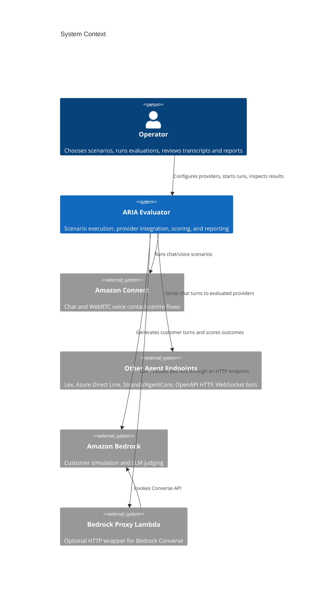
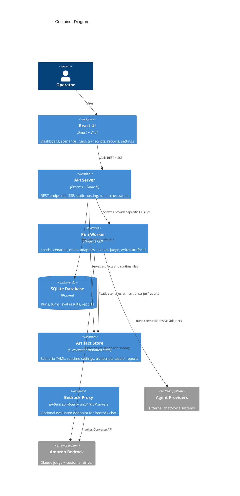
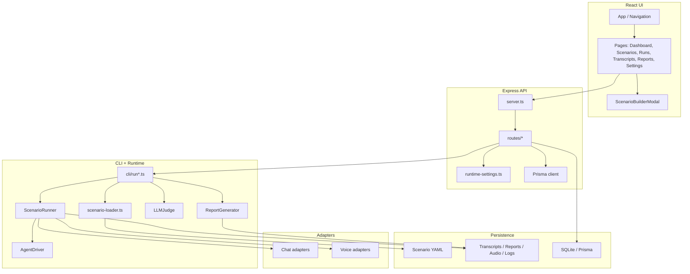

# Architecture Overview

## System Context (C4 Level 1)

ARIA Evaluator sits between a human operator and multiple conversational AI backends. It drives scenarios, captures the conversation, scores the outcome, and exposes the results back to the operator.

## Container Architecture (C4 Level 2)

The repo ships as a single application image, but the runtime behavior is split into several logical containers/components.

## Component Architecture (C4 Level 3)

The central flow starts in the UI, moves through the API, then hands off execution to the CLI and conversation engine.

## Architectural Patterns

## 1. Modular monolith

The repo is a single package and deployable application, but internally it is organized into distinct modules:

- API
- CLI
- conversation runtime
- adapters
- UI
- judging/reporting
- infrastructure

This keeps deployment simple while preserving clear boundaries.

## 2. Adapter pattern for provider integrations

`BaseAdapter` defines the common lifecycle:

- `connect`
- `sendMessage`
- `receive`
- `disconnect`

Each provider implements the same contract, which lets `ScenarioRunner` remain mostly provider-agnostic.

## 3. Worker handoff from API to CLI

The API does **not** execute scenario runs inline. Instead, `src/api/routes/runs.ts` spawns `npm run cli:<provider>` in a detached child process, streams logs via SSE, and ingests the resulting artifacts after completion.

That design isolates long-running runs from the request-response lifecycle.

## 4. Artifact-first execution

During a run, the primary outputs are written to disk:

- transcripts
- audio
- reports
- run logs

The API then indexes or summarizes those artifacts into SQLite. In practice, the filesystem is the detailed record; the database is the queryable index.

## 5. Dual-mode customer simulation

Scenarios run in one of two modes:

- **`script`**: fixed customer turns from YAML
- **`agent`**: Bedrock generates the next customer turn based on persona, goal, and conversation state

This allows both deterministic tests and more natural conversations.

## 6. Dual deployment model

The same application supports:

- **local Docker / docker-compose**
- **AWS ECS + ALB + CloudFront**

An optional Python Bedrock proxy can run either:

- as a **Lambda behind API Gateway**
- or as a **local HTTP server/container**

## Key Design Decisions

## Detached run execution from the API

**Decision:** Runs are started from the API but executed by the CLI in a separate process group.

**Why:** A scenario batch can run for minutes, stream logs continuously, and interact with external systems that may hang or disconnect.

**Trade-off:** The API needs extra logic to manage process lifecycle, collect logs, discover artifacts, and reconcile status back into Prisma.

## YAML as the scenario source of truth

**Decision:** Scenarios are stored as YAML files, including multi-document YAML.

**Why:** The format is easy to review, diff, batch-edit, and categorize by folder.

**Trade-off:** The API must validate and manipulate YAML carefully when editing individual docs in a multi-doc file.

## Bedrock used for both simulation and scoring

**Decision:** Amazon Bedrock powers:

- the **customer-side driver** (`AgentDriver`)
- the **judge** (`LLMJudge`)

**Why:** It makes the evaluator more realistic and lets the project reuse the same provider ecosystem.

**Trade-off:** The platform becomes sensitive to model latency, JSON formatting quirks, and guardrail interactions.

## Filesystem-backed runtime state

**Decision:** Reports, transcripts, runtime settings, scenarios, and audio are file-backed, with optional S3 synchronization in containerized AWS deployment.

**Why:** It simplifies portability between local and AWS modes and makes artifacts easy to inspect directly.

**Trade-off:** There is a split-brain risk between DB metadata and filesystem artifacts if cleanup or ingestion fails.

## Module Breakdown

## `src/api`

- Express server entry point
- routes for scenarios, runs, settings, reports, transcripts, and OpenAPI parsing
- static serving for built UI and generated artifacts
- Prisma-backed metadata queries

## `src/cli`

- provider-specific entry points like `run-connect.ts`, `run-lex.ts`, `run-openapi.ts`
- main execution logic in `run.ts`
- scenario discovery, provider validation, batch control, and judge/report orchestration

## `src/conversation`

- recursive YAML loading and templating
- run loop for both script and agent modes
- special handling for voice pacing, waiting, greeting capture, and escalation detection

## `src/adapters`

- Connect chat and WebRTC voice
- Lex chat
- Azure Direct Line / Copilot
- Strands / AgentCore HTTP
- custom HTTP chat
- OpenAPI-based HTTP chat
- WebSocket chat and custom WebSocket voice
- legacy Playwright-based `ConnectVoiceAdapter` still exists but is not the main voice path

## `src/judge`

- evaluation dimension catalog split across quality, task completion, security, and escalation
- Bedrock judge implementation with transcript sanitization for adversarial payloads

## `src/report`

- JSON and HTML report generation
- score aggregation and transcript embedding

## `src/ui`

- dashboard and operator workflows
- scenario explorer and builder
- run console with live logs, transcript extraction, and artifact preview
- settings editor for all supported providers

## `infra` and `lambda`

- Terraform modules and environments for local/dev/prod
- CloudFormation low-cost deployment template
- Docker entrypoint and local compose flow
- Python Bedrock proxy Lambda and local wrapper server

## Architectural Risks and Improvement Areas

1. **Run orchestration is process-based rather than queue-based.** It works locally and in small deployments, but a dedicated job worker model would be easier to scale and supervise.
2. **Filesystem + DB dual persistence requires reconciliation logic.** Today the API discovers artifacts after the fact; stronger transactional boundaries would reduce drift.
3. **Provider-specific behavior lives in many ad-hoc adapters.** The adapter abstraction is good, but shared retry/telemetry/payload-shaping utilities would reduce duplication.
4. **The repository contains committed runtime outputs.** That is useful for demos and analysis, but it increases noise and can blur the line between source and generated state.
