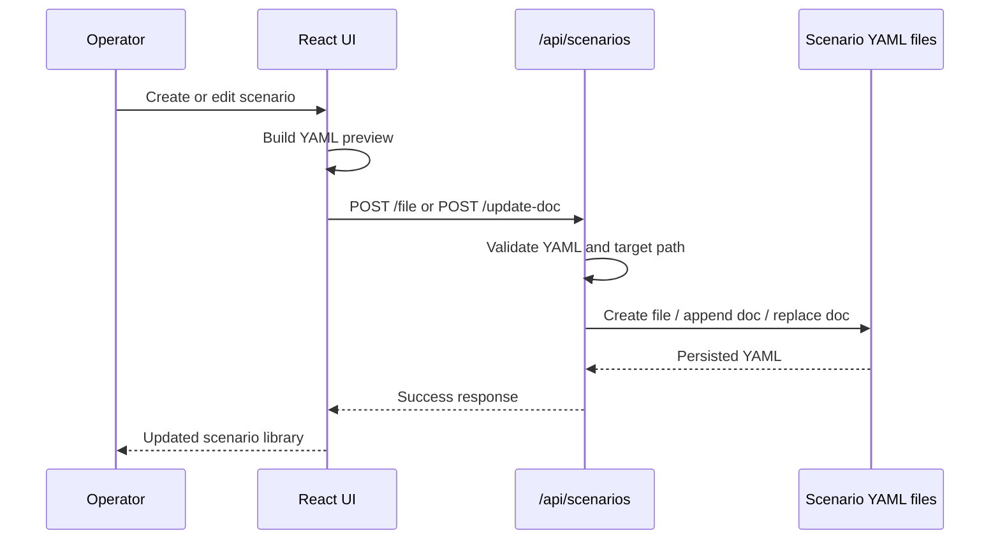
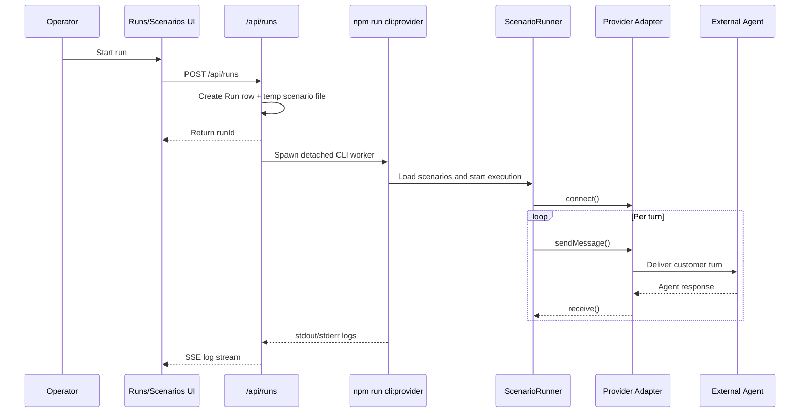
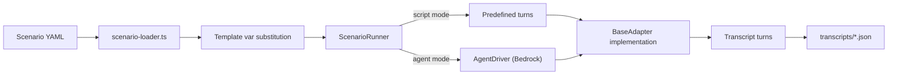
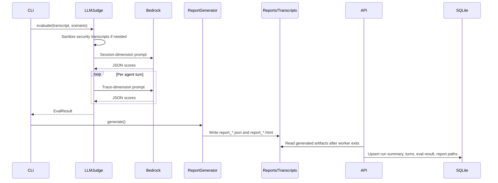
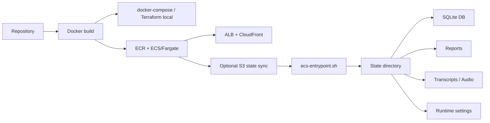
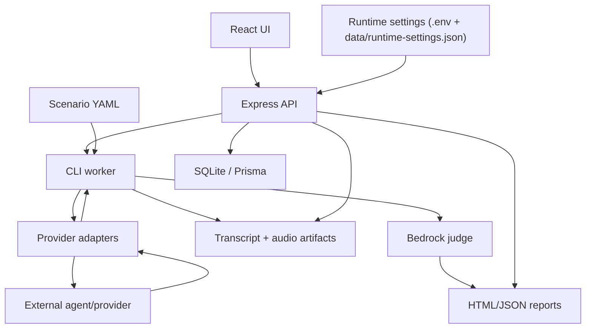

# Workflow Overview

## Core Workflows

## 1. Scenario authoring and storage

Scenarios originate as YAML files under `scenarios/`, but they can also be created and edited from the UI through `ScenarioBuilderModal`.

**Important details**

- Scenarios can be **single-document or multi-document YAML**
- The API supports:
  - listing all scenarios
  - listing scenario files and folders
  - reading raw file content
  - appending new scenario docs
  - replacing one doc within a multi-doc file
- Template placeholders like `{customer_name}` are resolved during execution, not at authoring time

## 2. Run execution from the UI

The most important runtime flow begins in the browser and hands off to a spawned CLI worker.

**Important details**

- The API uses **server-sent events (SSE)** so the UI can watch live progress
- Run logs are persisted under `reports/run-logs/`
- The UI can reconnect using `Last-Event-ID`, and the server replays stored log lines
- Hard timeout and "done grace" logic prevent orphaned run processes from lingering indefinitely

## 3. Conversation execution inside the worker

Once the CLI has started, `ScenarioRunner` takes over.

**Behavior by scenario mode**

- **Script mode**
  - uses the explicit `turns:` array from YAML
  - best for adversarial and deterministic checks
- **Agent mode**
  - Bedrock generates the next customer message from goal/persona/history
  - supports `[WAIT_FOR_AGENT]`, `[GOAL_ACHIEVED]`, and `[GIVE_UP]` control signals

**Voice-specific behavior**

- waits for opening greetings
- uses pacing delays before injecting speech
- avoids barging during unfinished agent speech
- can mix and save captured audio into a WAV artifact

## 4. Evaluation and report generation

After transcripts are produced, the CLI optionally scores them and writes reports.

**Important details**

- Security scenarios use **security-only dimensions** instead of standard helpfulness/correctness metrics
- The judge repairs malformed JSON output from the model where possible
- Aggregated run summaries are written into Prisma after the worker finishes
- HTML reports embed:
  - scenario scores
  - per-dimension breakdowns
  - transcript playback in text form

## 5. Deployment and runtime state management

The deployment workflow differs by environment, but both local and AWS modes share the same application image and entrypoint logic.

**Important details**

- `ecs-entrypoint.sh` restores state from S3 when configured
- the entrypoint wires `reports/`, `transcripts/`, and `data/` into a shared state directory
- Prisma schema is applied on startup with `prisma db push`
- the same container image supports local and ECS deployment

## Data Flow

The dominant data flow through the application is:

## Error Handling

The repository uses several distinct error-handling strategies depending on the layer.

## Adapter and runtime layer

- `SessionEndedError` distinguishes normal session closure from other failures
- `receive()` returns `null` on timeout per adapter contract
- voice flows maintain explicit timeout and settle-window controls
- `ScenarioRunner` records errors into transcripts instead of always crashing the whole batch

## API run orchestration

- `runs.ts` maintains:
  - a hard timeout for the worker
  - a grace period after a detected "Done." banner
  - persisted logs for replay and post-mortem review
- soft delete is used for runs instead of destructive removal

## Judge layer

- Bedrock failures are caught and converted into empty or partial score sets
- JSON repair handles common model output issues
- adversarial transcript sanitization reduces guardrail self-interference during scoring

## Scenario management

- YAML is validated before write operations
- path traversal is explicitly blocked for scenario and transcript/report file access

## Operational Observations

1. The system is optimized for **practical run visibility** rather than strict transactional purity.
2. The combination of **filesystem artifacts + Prisma indexing + SSE logs** makes runs inspectable even when external providers behave unpredictably.
3. Voice execution is significantly more specialized than chat execution; most of the runtime complexity sits there.
