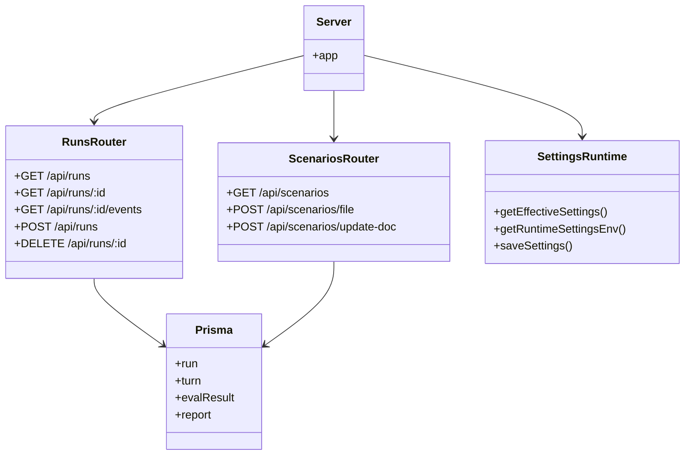

# Deep Dive: API and Run Orchestration

## Overview

The API layer is the coordination hub for the repository. It exposes operator-facing endpoints, serves the built UI and generated artifacts, manages editable runtime settings, and turns a user action like "run this scenario" into an asynchronous CLI worker process with streamed logs and persisted results.

This is implemented primarily in `src/api/`.

## Responsibilities

- expose REST endpoints for scenarios, runs, reports, transcripts, settings, and OpenAPI parsing
- host the built React UI and static artifact directories
- start long-running evaluation jobs in a detached child process
- stream live logs to browsers using SSE
- reconcile worker outputs back into Prisma models

## Architecture

## Key Files

- **`src/api/server.ts`**: Express bootstrap, route mounting, static asset hosting, health endpoint
- **`src/api/routes/runs.ts`**: run lifecycle, SSE streaming, child-process orchestration, artifact ingestion
- **`src/api/routes/scenarios.ts`**: scenario listing, file reads, YAML writes, multi-doc updates
- **`src/api/routes/settings.ts`**: runtime settings GET/PUT API
- **`src/api/runtime-settings.ts`**: editable setting whitelist and file-backed overrides
- **`src/api/routes/transcripts.ts`**: transcript listing and retrieval
- **`src/api/routes/reports.ts`**: report listing
- **`src/api/routes/openapi.ts`**: OpenAPI spec parsing and chat-endpoint detection

## Implementation Details

## Express server and static hosting

`server.ts` mounts all API routers under `/api/*`, then serves:

- `/reports`
- `/transcripts`
- `/audio`
- `public/`
- `dist/ui` when a build exists

That means the API server acts as both:

- the **backend API**
- the **static site host** for the operator UI and generated artifacts

## Runtime settings model

Editable runtime settings are intentionally constrained through `EDITABLE_SETTING_KEYS`. The effective configuration is resolved from:

1. file-backed overrides in `data/runtime-settings.json`
2. falling back to environment variables

This gives the UI a safe way to edit provider configuration without mutating arbitrary environment state.

## Run lifecycle

`runs.ts` is the most important orchestration file in the repo.

When a run starts:

1. the route validates selected scenario files or `file#index` refs
2. selected YAML docs are written into a temporary single run file under `.tmp/portal-runs`
3. a `Run` row is inserted in Prisma with `pending`
4. the route returns `202` and the `runId`
5. a detached `npm run cli:<provider>` process is spawned

## Why the worker is detached

The process is started detached so the API can:

- avoid request thread blocking
- manage the process group as a unit
- terminate it on hard timeout or graceful completion detection

## Log streaming

Logs from stdout/stderr are:

- appended to a run log file
- emitted over SSE to connected clients
- replayable for reconnecting browsers via `Last-Event-ID`

This is why the UI can show a live terminal even if the browser refreshes.

## Artifact discovery and ingestion

After the CLI exits, the route:

- parses transcript and report paths from log lines where possible
- falls back to recent-file discovery if needed
- reads transcript JSON files
- writes merged turns into Prisma
- upserts `EvalResult` and `Report` rows
- updates final run status to `completed` or `failed`

This makes the API a reconciliation layer between:

- **worker outputs on disk**
- **queryable metadata in SQLite**

## Scenario file editing

`scenarios.ts` supports both new-file creation and targeted replacement of one document in a multi-document YAML file. It validates YAML before writing and explicitly blocks invalid or traversing paths.

That is what powers the scenario builder UI.

## OpenAPI helper

`openapi.ts` is a utility route rather than part of the run engine. It:

- fetches a spec from a URL or raw payload
- parses JSON or YAML
- extracts candidate chat endpoints
- detects likely authentication mechanisms

It helps operators configure generic HTTP providers with less manual guesswork.

## API / Interface

### Main routes

| Route | Purpose |
|---|---|
| `GET /health` | health probe |
| `GET /api/scenarios` | list parsed scenarios |
| `GET /api/scenarios/files` | list YAML files |
| `POST /api/scenarios/file` | create/append scenario docs |
| `POST /api/scenarios/update-doc` | replace one doc in multi-doc YAML |
| `GET /api/runs` | recent runs |
| `POST /api/runs` | start a run |
| `GET /api/runs/:id/events` | live SSE stream |
| `GET /api/settings` / `PUT /api/settings` | view/update editable settings |
| `POST /api/openapi/parse` | parse OpenAPI metadata |

## Dependencies

- **Internal**: `src/conversation/scenario-loader.ts`, `src/db/client.ts`, `src/types/*`
- **External**: Express, CORS, Prisma, `js-yaml`, Node child-process and filesystem APIs

## Potential Improvements

1. Replace ad-hoc detached child processes with a proper job queue or worker supervisor.
2. Move artifact ingestion into a dedicated service layer so `runs.ts` is less monolithic.
3. Add structured run events instead of log-line parsing for transcript/report discovery.
4. Introduce stronger consistency guarantees between on-disk artifacts and DB summaries.
