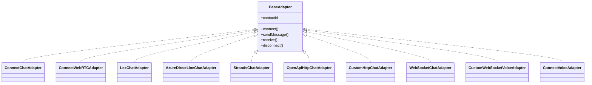

# Deep Dive: Adapter Layer

## Overview

The adapter layer is what lets ARIA Evaluator test many different providers using one conversation engine. Every provider-specific implementation conforms to the same `BaseAdapter` lifecycle, so the runner can treat Amazon Connect, Lex, Azure Direct Line, custom HTTP endpoints, and WebSocket bots as interchangeable runtime targets.

This is the most integration-heavy part of the codebase.

## Responsibilities

- provide a uniform conversation transport abstraction
- map provider-specific session startup into `connect()`
- deliver customer messages and receive agent responses
- normalize chat and voice backends into a common transcript model
- surface session-end and escalation signals back to the runner

## Architecture

## Key Files

- **`src/adapters/base.ts`**: core interface, `AdapterError`, `SessionEndedError`
- **`src/adapters/connect-chat.ts`**: Amazon Connect chat integration via StartChatContact + participant WebSocket
- **`src/adapters/connect-webrtc.ts`**: primary Connect voice adapter using StartWebRTCContact + Chime media
- **`src/adapters/lex-chat.ts`**: Lex `RecognizeText` chat adapter
- **`src/adapters/azure-directline-chat.ts`**: Azure Bot / Copilot over Direct Line polling
- **`src/adapters/strands-chat.ts`**: Strands / AgentCore HTTP adapter with optional SigV4 signing
- **`src/adapters/openapi-http-chat.ts`**: generic HTTP chat adapter configured from OpenAPI-discovered fields
- **`src/adapters/custom-http-chat.ts`**: generic HTTP chat adapter with configurable message/response fields
- **`src/adapters/websocket-chat.ts`**: configurable JSON/raw WebSocket chat adapter
- **`src/adapters/custom-websocket-voice.ts`**: generic or Deepgram WebSocket voice adapter
- **`src/adapters/connect-voice.ts`**: older Playwright/CCP-based voice path still present in the repo
- **`public/evaluator-ccp.html`**: helper page used by the Playwright voice flow

## Implementation Details

## The common contract

The runner expects every adapter to support:

1. **`connect()`** to establish a session
2. **`sendMessage()`** to send a customer turn
3. **`receive()`** to wait for an agent turn or timeout
4. **`disconnect()`** to cleanly close the session

This is a good example of a lightweight but effective abstraction: the conversation engine only needs one mental model.

## Chat adapters

### Amazon Connect chat

`ConnectChatAdapter` is the most provider-specific chat implementation. It:

- resolves a flow name to an ID if needed
- starts a chat contact
- opens a participant WebSocket
- filters IVR/contact-flow noise
- captures escalation phrases
- optionally sends a `SESSION_START` message for authenticated flows

It also stores an **opening greeting** separately so the runner can treat it as turn 0.

### Lex

`LexChatAdapter` is intentionally simple: one `RecognizeText` request per customer message, with response messages concatenated into a single agent reply.

### Azure Direct Line / Copilot

`AzureDirectLineChatAdapter` starts a Direct Line conversation, posts activities, then polls for non-user messages from the bot.

### Strands / AgentCore

`StrandsChatAdapter` is more configurable than most adapters:

- custom message/response/history/session fields
- optional bearer auth
- optional AWS SigV4 signing

This makes it suitable for heterogeneous AgentCore-style backends.

### OpenAPI and custom HTTP

`OpenApiHttpChatAdapter` and `CustomHttpChatAdapter` both send JSON HTTP requests per turn, but the OpenAPI version explicitly models auth modes and is paired with the API-side OpenAPI parser.

### WebSocket chat

`WebSocketChatAdapter` supports:

- auth headers
- optional subprotocol
- init JSON
- templated outgoing frames
- event-type filtering
- dot-path extraction for reply text

This makes it the catch-all adapter for custom WS-based bots.

## Voice adapters

### Connect WebRTC

`ConnectWebRTCAdapter` is the primary voice path currently wired into the CLI. It is one of the most technically sophisticated modules in the repo:

- starts Connect WebRTC contacts
- manages Chime meeting sessions
- synthesizes customer speech with Polly
- receives speech via streaming transcription
- detects escalation phrases
- records and mixes audio into a WAV file

It also includes retry logic and several tuning knobs for voice quality and stability.

### Custom WebSocket voice

`CustomWebSocketVoiceAdapter` supports:

- **Deepgram Voice Agent**
- **AgentCore-style WebSocket voice**
- **generic JSON-over-WebSocket voice**

It separates control events from agent speech payloads and can wait for protocol-specific readiness messages.

### Legacy Playwright voice adapter

`ConnectVoiceAdapter` and `public/evaluator-ccp.html` implement an older browser-driven approach that hosts the Amazon Connect CCP in a page, patches iframe permissions, injects audio, and captures remote agent speech.

It is important to note this still exists in the repo, but the main CLI path now uses **`ConnectWebRTCAdapter`** instead.

## Error and state model

Adapters distinguish:

- **transport/setup errors** via `AdapterError`
- **normal/abnormal session closure** via `SessionEndedError`
- **timeout** by returning `null` from `receive()`

This is why the runner can keep going through recoverable conditions without turning every provider hiccup into a fatal crash.

## API / Interface

### Provider coverage

| Provider | Channel(s) | Main file |
|---|---|---|
| Amazon Connect | chat, voice | `connect-chat.ts`, `connect-webrtc.ts` |
| Amazon Lex | chat | `lex-chat.ts` |
| Azure Bot / Copilot | chat | `azure-directline-chat.ts` |
| Strands / AgentCore | chat | `strands-chat.ts` |
| OpenAPI HTTP | chat | `openapi-http-chat.ts` |
| Custom HTTP | chat | `custom-http-chat.ts` |
| WebSocket | chat | `websocket-chat.ts` |
| Custom voice WS / Deepgram | voice | `custom-websocket-voice.ts` |

## Dependencies

- **Internal**: `ScenarioRunner`, transcript types, runtime settings
- **External**: AWS SDKs, Chime SDK, Polly, Transcribe Streaming, WebSocket, Deepgram, Playwright

## Potential Improvements

1. Consolidate shared queue/resolver logic used by many chat adapters into reusable helpers.
2. Add a common telemetry hook for request/response timing across all adapters.
3. Separate legacy voice code more clearly from active voice code to reduce cognitive load.
4. Add richer provider capability metadata so the UI and CLI do not have to duplicate supported-channel logic.
