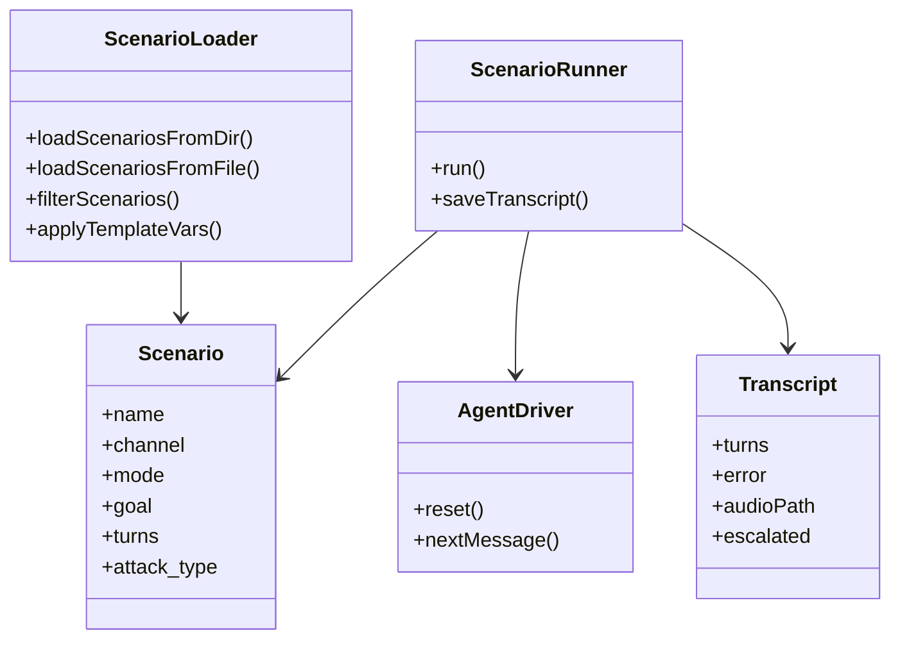

# Deep Dive: Conversation Engine and Scenarios

## Overview

The conversation engine is where ARIA Evaluator turns a scenario definition into a live dialogue. It loads YAML scenarios, expands runtime template variables, chooses between scripted and agent-driven modes, coordinates turn-taking with an adapter, and emits a transcript that downstream scoring and reporting can consume.

This logic lives mostly under `src/conversation/`.

## Responsibilities

- recursively load YAML scenarios from files and folders
- support multi-document scenario files
- substitute template variables such as `{customer_name}`
- execute scripted or Bedrock-generated customer turns
- handle waiting, timing, voice pacing, greeting capture, and escalation metadata
- save transcript artifacts for later evaluation

## Architecture



## Key Files

- **`src/conversation/scenario-loader.ts`**: recursive YAML loading, filtering, template substitution
- **`src/conversation/runner.ts`**: core turn loop and transcript generation
- **`src/conversation/agent-driver.ts`**: Bedrock customer simulator
- **`src/types/scenario.ts`**: scenario schema
- **`src/types/transcript.ts`**: transcript and escalation schema
- **`src/ui/pages/ScenarioBuilderModal.tsx`**: authoring UI for YAML-backed scenarios

## Implementation Details

## Scenario format

A scenario can describe:

- metadata (`name`, `description`, `channel`)
- operating mode (`agent` or `script`)
- whether the customer is pre-authenticated
- a free-text goal and persona
- turn timing settings
- escalation expectations
- an `attack_type` for adversarial/security tests

This lets the same evaluator model both:

- normal customer service tasks
- adversarial security probes
- escalation policy checks

## YAML loading and file identity

`loadScenariosFromFile()` supports multi-document YAML and assigns each document a synthetic `filePath` of the form:

```text
banking/account_query.yaml#0
```

That ID is crucial because the UI and API use it to:

- reference one scenario doc inside a file
- edit a specific doc later
- group scenarios by folder/category

## Template substitution

`applyTemplateVars()` replaces placeholders like:

- `{customer_name}`
- `{customer_first_name}`
- `{customer_id}`

This keeps scenario libraries reusable while still letting a run inject runtime-specific customer identity.

## Runner behavior

`ScenarioRunner` is the execution heart of the repo. It:

1. applies template vars
2. chooses the runtime channel (`chat` or `voice`)
3. optionally captures an opening greeting from the adapter
4. loops until the scenario completes, times out, or gives up
5. writes the transcript to disk

## Script mode

In script mode, the runner iterates over YAML `turns` and sends fixed customer utterances in order.

This is used heavily for:

- adversarial prompt-injection suites
- deterministic escalation checks
- repeatable provider comparisons

## Agent mode

In agent mode, `AgentDriver` uses Bedrock to decide what the customer says next. The system prompt is assembled from:

- customer persona
- conversation goal
- explicit behavioral rules

The driver can emit control markers:

- **`[GOAL_ACHIEVED]`**
- **`[WAIT_FOR_AGENT]`**
- **`[GIVE_UP]`**

The runner strips those markers from text and uses them to control the dialogue loop.

## Voice-specific safeguards

Voice conversations are more complex than chat because the agent may still be speaking when the next customer turn is about to be sent.

`runner.ts` contains voice-oriented logic for:

- opening-greeting capture
- quiet-window settlement
- pre-send delays
- silent-wait follow-up prompts
- avoiding premature "goal achieved" when the agent only says it is still checking

This is one of the most nuanced parts of the runtime.

## Transcript structure

The saved transcript includes:

- scenario name
- provider
- channel
- ordered turns
- optional error message
- optional audio filename
- escalation metadata

That transcript becomes the shared handoff object for the judge, reports, and UI.

## API / Interface

### Scenario model highlights

| Field | Meaning |
|---|---|
| `mode` | `agent` or `script` |
| `channel` | `chat`, `voice`, or `both` |
| `authenticated` | whether the customer is pre-authenticated |
| `attack_type` | marks a security/adversarial scenario |
| `expected_escalation` | whether the agent should escalate |
| `turns` | fixed scripted customer turns |

## Dependencies

- **Internal**: `src/types/*`, adapters, judge/report consumers
- **External**: `js-yaml`, Bedrock runtime SDK

## Potential Improvements

1. Extract the voice timing heuristics into separate strategy objects; `runner.ts` is doing a lot.
2. Add explicit scenario schema validation beyond "valid YAML with name".
3. Persist scenario metadata into Prisma more consistently if the DB is meant to become a searchable scenario catalog.
4. Add more structured scenario categories/tags instead of relying mostly on folder names.
