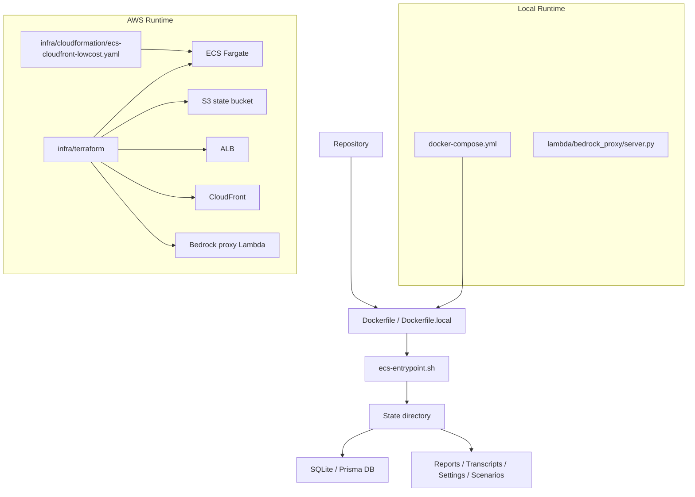

# Deep Dive: Infrastructure and Deployment

## Overview

The repository includes a full deployment story, not just application code. It supports:

- local Docker-based execution
- local Bedrock proxy development
- AWS ECS/Fargate deployment through Terraform
- a separate CloudFormation low-cost deployment path
- optional Bedrock proxy Lambda hosting

This infrastructure layer is mostly under `infra/` and `lambda/`.

## Responsibilities

- package the app into a reusable image
- wire persistent runtime state for DB, reports, transcripts, and settings
- deploy AWS networking, compute, storage, IAM, edge, and proxy components
- provide a local developer path that mirrors production closely enough to be useful

## Architecture

## Key Files

- **`Dockerfile`**: production/runtime image, pinned to `linux/amd64` for ECS
- **`Dockerfile.local`**: local-development image without platform pinning
- **`docker-compose.yml`**: local app + optional Bedrock proxy stack
- **`infra/docker/ecs-entrypoint.sh`**: startup logic, state restore/sync, Prisma schema apply
- **`infra/terraform/README.md`**: Terraform usage overview
- **`infra/terraform/environments/*`**: local, dev, prod, and bedrock-proxy-local compositions
- **`infra/terraform/modules/*`**: reusable AWS modules
- **`infra/cloudformation/ecs-cloudfront-lowcost.yaml`**: alternative low-cost stack template
- **`scripts/deploy-ecs-cloudfront.sh`**: CloudFormation deployment helper
- **`lambda/bedrock_proxy/handler.py`**: Bedrock Converse proxy Lambda
- **`lambda/bedrock_proxy/server.py`**: local HTTP wrapper for the Lambda handler

## Implementation Details

## Container model

The app is built in two stages:

- a **build stage** that runs `npm ci`, Prisma generate, and `npm run build`
- a **runtime stage** that copies the built app and starts through `ecs-entrypoint.sh`

The production `Dockerfile` pins the runtime image to `linux/amd64` because the target ECS task family is x86-based.

## Stateful startup

`ecs-entrypoint.sh` is a critical operational file. It:

- creates state directories
- optionally restores state from S3
- symlinks `reports/`, `transcripts/`, and `data/` into the app directory
- sets runtime environment variables such as `DATABASE_URL` and `EVAL_REPORT_OUTPUT_DIR`
- applies the Prisma schema with `prisma db push`
- starts the API server
- runs a background S3 sync loop when configured

This is how the same container can run locally or on ECS with durable state behavior.

## Local developer deployment

`docker-compose.yml` provides:

- `aria-evaluator` service
- optional `bedrock-proxy` profile

It bind-mounts:

- `./scenarios`
- `./data`
- `${HOME}/.aws`

That makes local iteration practical without repeated image rebuilds for every scenario change.

## Terraform layout

The Terraform code is modular and split into:

- **modules**
  - networking
  - ecr
  - s3
  - iam
  - ecs
  - alb
  - cloudfront
  - docker-local
  - docker-bedrock-proxy
  - bedrock-lambda
- **environments**
  - `local`
  - `bedrock-proxy-local`
  - `dev`
  - `prod`

This is a mature structure for a single-service deployment repo.

## AWS deployment composition

The `dev/main.tf` environment shows the main hosted topology:

- VPC/public subnets
- ECR repository
- S3 state bucket
- IAM roles
- ALB
- ECS service
- optional Bedrock Lambda
- CloudFront distribution

The app is therefore designed to sit behind **CloudFront -> ALB -> ECS**, with state synced to S3.

## CloudFormation alternative

`scripts/deploy-ecs-cloudfront.sh` implements an opinionated deployment workflow around `infra/cloudformation/ecs-cloudfront-lowcost.yaml`. It:

- validates a local production build first
- bootstraps the stack if needed
- logs into ECR
- builds and pushes the image
- syncs runtime env/scenario inputs to S3
- deploys the stack
- invalidates CloudFront

This is a convenient operational path when the team wants a scripted deployment without working directly in Terraform.

## Bedrock proxy

The Python proxy under `lambda/bedrock_proxy/` exposes:

- `GET /health`
- `POST /chat`

It accepts:

- single-message payloads
- multi-message payloads
- evaluator-style `history + message` payloads

and forwards them to Bedrock Converse. This lets Bedrock models be exercised as if they were generic HTTP chat endpoints.

## API / Interface

### Infrastructure surfaces

| Surface | Purpose |
|---|---|
| Docker image | package and run the app |
| docker-compose | local service orchestration |
| Terraform environments | local/dev/prod/proxy deployment plans |
| CloudFormation script | one-command low-cost deployment |
| Bedrock proxy Lambda | optional HTTP bridge to Bedrock Converse |

## Dependencies

- **Internal**: built app artifacts, Prisma schema, runtime settings conventions
- **External**: Docker, AWS CLI, Terraform, CloudFormation, ECS, S3, CloudFront, boto3

## Potential Improvements

1. The repo contains both Terraform and CloudFormation deployment paths; documenting the preferred one for each environment would reduce ambiguity.
2. State synchronization is operationally practical but not strongly transactional; managed persistent volumes or a DB service could reduce reconciliation risk.
3. The Bedrock proxy is intentionally thin; shared request schema validation could make it safer for broader reuse.
4. The local and hosted deployments share the same image well, but observability and health telemetry are still fairly lightweight.
