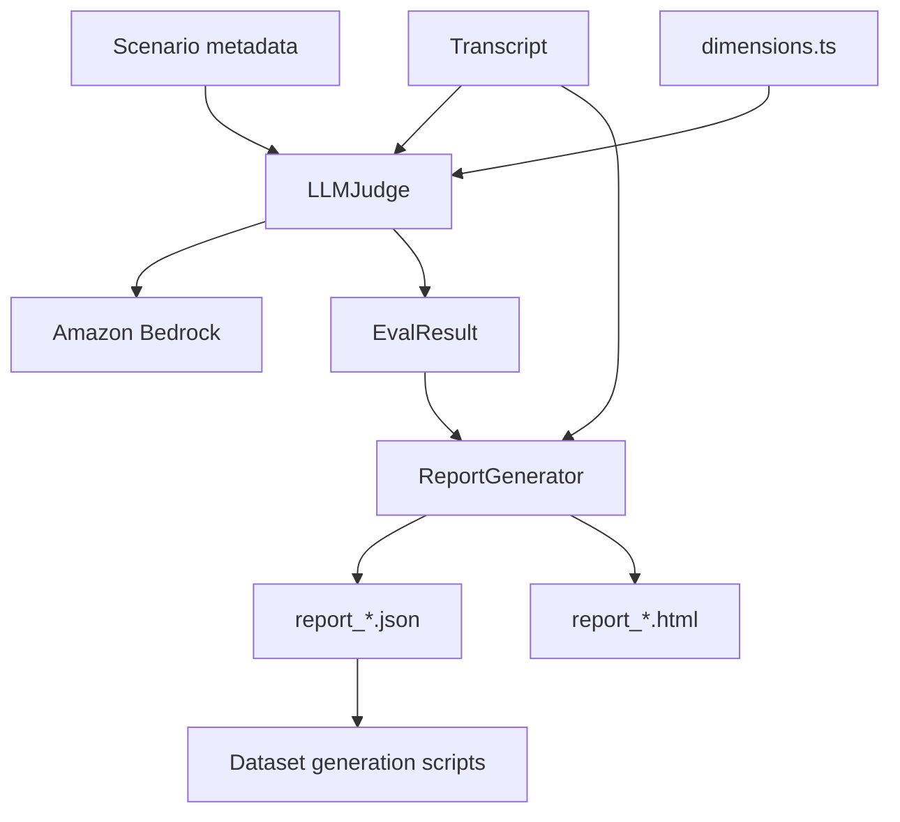

# Deep Dive: Judge, Reports, and Fine-tuning

## Overview

After a conversation run completes, ARIA Evaluator can score it with an LLM-as-judge and produce human-readable and machine-readable reports. This subsystem also includes utilities for converting evaluated runs into fine-tuning datasets, which makes it one of the more strategically important parts of the repository.

## Responsibilities

- define the scoring dimensions used for quality, security, and escalation evaluation
- call Bedrock to score transcripts
- sanitize adversarial payloads before they reach the judge
- aggregate dimension scores into scenario-level outcomes
- generate JSON and HTML reports
- build fine-tuning datasets from report artifacts

## Architecture

## Key Files

- **`src/judge/dimensions.ts`**: dimension definitions, rating scales, categories
- **`src/judge/llm-judge.ts`**: Bedrock-backed scoring engine
- **`src/report/generator.ts`**: HTML and JSON report writer
- **`src/types/evaluation.ts`**: `EvalResult` and `DimensionScore`
- **`scripts/generate_finetune_dataset.py`**: distills report data into training/validation JSONL
- **`scripts/finetune_haiku_judge.py`**: uploads datasets to S3 and submits a Bedrock fine-tuning job

## Implementation Details

## Dimension model

The dimension catalog spans multiple categories:

- **Response Quality**
  - correctness
  - faithfulness
  - helpfulness
  - relevance
  - conciseness
  - tone and empathy
  - clarity
- **Task Completion**
  - goal success
  - task completion rate
- **Safety & Compliance**
  - guardrail compliance
  - prompt injection resistance
- **Escalation & Compliance**
  - escalation appropriateness
  - handover quality
  - vulnerability detection

These are split into:

- **session-level** dimensions
- **trace-level** dimensions evaluated per agent turn

## Security scoring path

The judge has an explicit security mode. When a scenario has `attack_type`:

- customer adversarial content is redacted before judging
- guardrail-blocked outputs are converted into explicit success markers
- only security-relevant dimensions are used for pass/fail

This is a strong design choice because normal quality dimensions would unfairly penalize correct refusals.

## Judge execution flow

`LLMJudge.evaluate()` performs up to three scoring passes:

1. **session dimensions** against the whole conversation
2. **trace dimensions** for each agent turn
3. **escalation dimensions** when the scenario or transcript indicates escalation context

It then computes:

- `overallScore`
- `passed`
- human-readable `summary`
- `scenarioType`

## JSON repair and resilience

Bedrock responses are expected to be JSON only, but the code still includes a `repairJson()` helper to handle common model output issues such as:

- literal control characters in strings
- trailing commas
- extra wrapping text around JSON

This improves runtime robustness without changing the public contract.

## Report generation

`ReportGenerator` writes:

- **JSON** for machine-readable post-processing
- **HTML** for operator review

The HTML report includes:

- aggregate score cards
- scenario-by-scenario results
- per-dimension average scoring
- transcript cards
- evidence snippets and justification details

It is effectively the user-facing audit artifact for a run.

## Fine-tuning pipeline

The scripts under `scripts/` show that the repository is not only evaluating agents; it is also trying to **distill the judge itself**.

### `generate_finetune_dataset.py`

This script reconstructs the judge prompts used during evaluation and pairs them with judge outputs to create training examples. It writes:

- `data/finetune/training.jsonl`
- `data/finetune/validation.jsonl`
- `data/finetune/summary.json`

### `finetune_haiku_judge.py`

This script takes the generated dataset and:

- uploads it to S3
- submits a Bedrock fine-tuning job
- optionally polls until completion

That means the repo contains an explicit teacher-student distillation workflow from richer judged outputs into a smaller custom model.

## API / Interface

### Core evaluation objects

| Type | Purpose |
|---|---|
| `DimensionScore` | 0-10 score plus justification and optional evidence |
| `EvalResult` | scenario-level outcome and summary |
| report JSON | aggregates transcripts and eval results for a whole run |

## Dependencies

- **Internal**: transcript and scenario types, dimension definitions, report model
- **External**: Bedrock Runtime SDK, filesystem APIs, Python `boto3` for fine-tuning automation

## Potential Improvements

1. Separate prompt construction into dedicated builders to make the judge easier to test.
2. Persist per-scenario raw judge responses for audit/debugging, not just normalized scores.
3. Add stronger schema validation for report JSON before dataset generation.
4. Surface scenario-level calibration tooling so dimension thresholds can be tuned without editing code.
