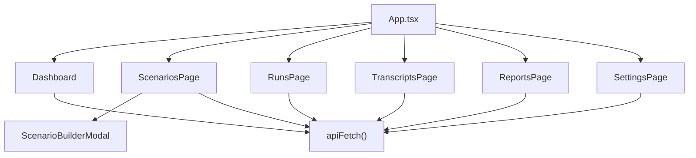

# Deep Dive: React UI

## Overview

The React UI is the operator-facing control plane for ARIA Evaluator. It is a single-page application served by the Express API and organized around the operational lifecycle of an evaluation program:

- inspect recent runs
- browse and author scenarios
- launch new evaluations
- review transcripts
- open reports
- manage provider configuration

The UI lives under `src/ui/`.

## Responsibilities

- present evaluation status and summary metrics
- expose scenario browsing, filtering, and editing
- start runs and stream live progress
- preview transcripts and reports
- manage runtime provider configuration

## Architecture

## Key Files

- **`src/ui/App.tsx`**: top-level page navigation and layout shell
- **`src/ui/main.tsx`**: React bootstrap
- **`src/ui/lib/api.ts`**: thin fetch wrapper
- **`src/ui/pages/Dashboard.tsx`**: recent-run overview and summary cards
- **`src/ui/pages/ScenariosPage.tsx`**: scenario explorer and direct run launcher
- **`src/ui/pages/ScenarioBuilderModal.tsx`**: scenario authoring and live YAML preview
- **`src/ui/pages/RunsPage.tsx`**: run list, live logs, transcript parsing, artifact previews, new-run modal
- **`src/ui/pages/TranscriptsPage.tsx`**: transcript browser and chat-style viewer
- **`src/ui/pages/ReportsPage.tsx`**: embedded HTML report preview
- **`src/ui/pages/SettingsPage.tsx`**: provider configuration editor

## Implementation Details

## Navigation model

The UI uses a simple in-app page state rather than React Router. `App.tsx` switches among page components and can deep-link using `?page=` and `?file=` query parameters.

This keeps the UI lightweight and easy to serve from the same Express app.

## Dashboard

`Dashboard.tsx` summarizes:

- total runs
- pass/fail counts
- quality-score average
- recent run table

An important detail is that **security-only runs are excluded from the headline quality average** so adversarial refusals do not distort the top-level score.

## Scenarios page

`ScenariosPage.tsx` is both a library browser and a lightweight launcher. It:

- fetches parsed scenarios and runtime settings
- groups scenarios by category and subcategory based on path
- filters by channel
- chooses a provider
- can launch chat, voice, or sequential both-channel runs

It also surfaces a detailed side panel for the currently selected scenario.

## Scenario builder

`ScenarioBuilderModal.tsx` is more than a text editor:

- it has a guided form model
- applies sensible defaults by scenario type
- builds YAML in real time
- supports both create and edit mode
- writes back through the scenarios API

This is a strong usability layer over a file-backed scenario library.

## Runs page

`RunsPage.tsx` is the richest UI file in the repo. It handles:

- viewing historical runs
- starting new runs
- parsing live logs into a synthetic transcript view
- showing progress for parallel scenario batches
- previewing transcript JSON, report JSON, and report HTML in modals

Because the worker streams logs rather than structured events only, the page includes parsing logic to turn those log lines into user-friendly live displays.

## Reports and transcripts

The artifact viewers are intentionally lightweight:

- `ReportsPage` embeds generated HTML in an `iframe`
- `TranscriptsPage` shows saved transcript JSON in a chat-like presentation

This works well because the server already exposes the generated artifact folders as static paths.

## Settings page

`SettingsPage.tsx` is effectively an operator console for all supported providers. It organizes settings by provider section and general section, with:

- required/optional markers
- inline hints
- sensitive-field masking
- support for providers beyond what the README alone can comfortably explain

That makes the UI the primary configuration surface for day-to-day use.

## API / Interface

### Main UI-driven API calls

| UI area | Main endpoints |
|---|---|
| Dashboard | `/api/runs` |
| Scenarios | `/api/scenarios`, `/api/settings`, `/api/runs` |
| Runs | `/api/runs`, `/api/runs/:id`, `/api/runs/:id/events` |
| Transcripts | `/api/transcripts`, `/api/transcripts/:filename` |
| Reports | `/api/reports` |
| Settings | `/api/settings` |

## Dependencies

- **Internal**: shared types and API routes
- **External**: React, browser `fetch`, EventSource

## Potential Improvements

1. The UI currently parses several log-line formats; richer structured events from the backend would simplify the client.
2. A routing library could make deep-linking and browser history cleaner if the UI grows.
3. The stateful pages are large and would benefit from extraction into hooks or view-model helpers.
4. There is room for better differentiation between historical artifacts and in-progress run state.
