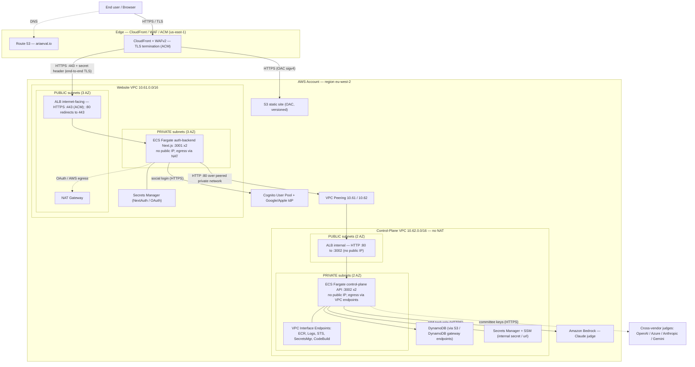
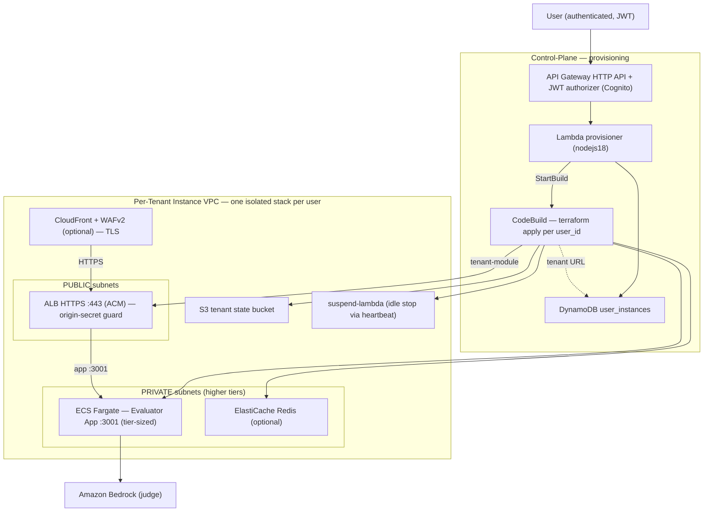
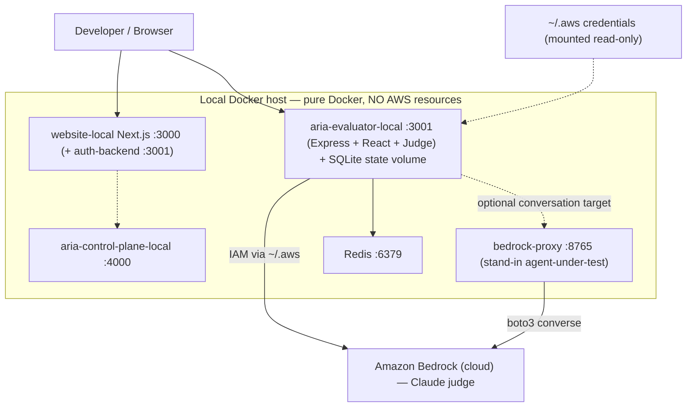

# CLAUDE.md — Project Instructions for AI Development

**Project**: ARIA Evaluator — AI Safety & Quality Evaluation Platform  
**Last Updated**: June 2026  
**Status**: Production-Ready ✅

---

## Quick Project Summary

**ARIA** is a TypeScript/Node.js application that:
- Tests conversational AI agents (Amazon Connect, Lex, Azure, OpenAPI, etc.)
- Runs structured test scenarios (adversarial, functional, escalation, edge-case)
- Scores responses across 15 dimensions using Claude/Bedrock as the LLM judge
- Detects security vulnerabilities (prompt injection, jailbreaks, social engineering)
- Validates compliance (FCA Consumer Duty, PCI DSS, HIPAA, GDPR, escalation policies)
- Provides a React UI dashboard + REST API + CLI tools

**Tech Stack**: TypeScript · Express · React · Prisma · SQLite/PostgreSQL · AWS (Bedrock, Connect, Lex, etc.)

---

## Architecture at a Glance

```
User Request (React UI / CLI / API)
         ↓
   Express API Server
         ↓
   ┌─────────────────────────────────────┐
   │  Conversation Engine                │
   │  - Scenario Loader (YAML)          │
   │  - ScenarioRunner (orchestrator)   │
   │  - Agent Driver (LLM customer)     │
   └─────────────────────────────────────┘
         ↓
   ┌─────────────────────────────────────┐
   │  Adapter Layer (pluggable)         │
   │  - ConnectVoiceAdapter             │
   │  - LexAdapter                      │
   │  - AzureAdapter                    │
   │  - OpenApiAdapter                  │
   │  - WebSocketAdapter                │
   └─────────────────────────────────────┘
         ↓
   ┌─────────────────────────────────────┐
   │  Agent Under Test                  │
   │  (Amazon Connect / Lex / etc.)     │
   └─────────────────────────────────────┘
         ↓
   Transcript Captured
         ↓
   ┌─────────────────────────────────────┐
   │  LLM Judge (Bedrock)               │
   │  - 15 evaluation dimensions        │
   │  - Scoring logic                   │
   │  - Cost tracking                   │
   └─────────────────────────────────────┘
         ↓
   EvalResult (scores) → Database
         ↓
   Reports & Dashboard
```

---

## Infrastructure Architecture (AWS + Local)

ARIA is a **multi-tenant SaaS**: a public marketing/auth website, a **control-plane** that provisions an isolated per-tenant copy of the evaluator app, and the **evaluator app** itself (Express + React + LLM judge). All infrastructure is Terraform IaC under `infra/terraform/` (reusable `modules/` + per-environment roots under `environments/`). Primary region is **eu-west-2**; CloudFront / WAF / ACM live in **us-east-1**. The diagrams follow the AWS layered convention (Edge → VPC & subnet tiers → Compute → Data → Security/Observability).

### Environments

| Environment (dir) | Purpose | Key resources |
|---|---|---|
| `environments/local`, `*-local` | Local dev — **pure Docker, no AWS** | Evaluator / control-plane / website / bedrock-proxy containers |
| `bootstrap/` | Account foundation (run once) | TF-state S3, lock + `aria-heartbeats` DynamoDB, KMS, ECR repos |
| `environments/control-plane-prod` | Control plane | VPC `10.62.0.0/16`, internal ALB, ECS, DynamoDB, provisioning (CodeBuild + Lambda + API GW) |
| `environments/website-prod` | Public website + auth | VPC `10.61.0.0/16`, CloudFront+S3, ALB+ECS auth-backend, Cognito |
| `environments/connectivity-prod` | Cross-app link | VPC peering + routes + SG rule (website ↔ control-plane) |
| `environments/prod` (+ `tenant-module`) | One provisioned tenant instance | Per-tenant VPC, ALB, ECS evaluator app, S3, Redis |
| `environments/saas-platform` | Account security | GuardDuty + Security Hub + findings bucket |
| `environments/{dev,control-plane-dev,website-dev}` | Non-prod mirrors | Same shapes, smaller, `force_destroy=true` |

### PROD — Platform (website + control-plane)



**Request path:** `Browser → Route 53 → CloudFront (+WAF)` then split by path to either the **S3 static site** (default + `/_next/static/*`) or the **auth-backend ALB** (`/api/*`, gated by a secret header CloudFront injects so the ALB rejects direct traffic). The Next.js **auth-backend** (ECS Fargate `:3001`, internet-facing ALB) brokers social login through **Cognito → Google/Apple**, and reaches the **control-plane internal ALB** over the **VPC peering** link via `CONTROL_PLANE_INTERNAL_URL`. The **control-plane API** (ECS Fargate `:3002`, private subnets, egress through **VPC interface/gateway endpoints**, no NAT) reads/writes **DynamoDB**, pulls config from **Secrets Manager/SSM**, and invokes **Bedrock** (plus optional cross-vendor judge providers) for evaluation.

### Network security & TLS posture

What is and isn't encrypted, per hop:

| Hop | Listener | Encrypted in transit? | What protects it |
|---|---|---|---|
| Browser → CloudFront | **HTTPS 443** (ACM, TLS 1.2+) | ✅ Yes | WAFv2, ACM cert, HSTS |
| CloudFront → S3 static | **HTTPS** (OAC, SigV4) | ✅ Yes | Origin Access Control |
| CloudFront → auth ALB | **HTTPS :443** (regional ACM, `origin.ariaeval.io`) | ✅ Yes | `https-only` origin policy + `X-CF-Origin-Secret` header |
| auth-backend → control-plane ALB | **HTTP :80** | ⚠️ No — but private/peered, never public | SG rule (ALB SG ← auth ECS SG) + VPC peering |
| ECS → Bedrock / DynamoDB / Secrets / ECR | **HTTPS** | ✅ Yes | IAM + VPC endpoints |
| Per-tenant instance ALB (`tenant-module`) | **HTTPS :443** (ACM) | ✅ Yes | — (already end-to-end) |

**The public website path is end-to-end TLS** (browser → CloudFront → auth ALB all HTTPS), and the auth-backend now runs in **private subnets**:

- **CloudFront → auth ALB** uses **HTTPS :443** to a custom origin domain (`origin.ariaeval.io`) backed by a **regional ACM cert**; CloudFront's origin protocol policy is **`https-only`** and the `X-CF-Origin-Secret` header still blocks direct access. The ALB's `:80` listener now **redirects to 443**.
- The auth-backend **ECS tasks run in private subnets** with **no public IP**; outbound traffic (Google/Apple OAuth, AWS APIs) egresses through a **NAT gateway**. The ALB stays in the public subnets.
- **Control-plane internal ALB (`:80`)** is the one remaining plaintext hop, but it stays on the **private peered network** (never public) so exposure is low. It can be moved to `:443` later by passing `acm_certificate_arn` to `modules/alb` (already supported) with an internal domain.
- **Per-tenant instances** already use HTTPS :443 + ACM.

> This reflects the IaC after the website-prod hardening (`modules/website-auth`: ALB `:443` + regional ACM + private subnets/NAT, gated on a custom domain; `modules/website-frontend`: CloudFront origin `https-only`). It takes effect on the next `terraform apply` of website-prod; `website-dev` (no custom domain) stays on `:80`/public.

### Evaluator egress architecture — current posture, hardening & roadmap

**Current state (Option A).** The pooled `evaluator-prod` ECS tasks (and the `website-auth` ALB) run **in public subnets with public IPv4s** (`assign_public_ip = true`) and egress to the internet directly via the IGW. There is **no active inbound exposure** — the task security group only allows ingress from the ALB SG, and the public ALB is itself origin-locked to CloudFront via the `X-CF-Origin-Secret` header + WAF — so the public IP is used purely for *outbound*. The evaluator **must** reach non-AWS endpoints (OpenAI, Anthropic, Google Gemini) that VPC endpoints can't cover, so unlike the private `control-plane-prod`, it can't go endpoint-only; it needs either a public IP (today) or a NAT.

The residual risks of Option A are defense-in-depth, not an open door: **R1** — the SG is the single thing between a routable public IP and the internet, so one bad `0.0.0.0/0` rule = instant exposure; **R2** — no egress choke point, so a compromised PII-handling container has unrestricted outbound (exfil/C2); **R4** — it trips standard audit controls (AWS FSBP `[ECS.2]`, CIS/PCI "no public IPs on compute").

**Cheap hardening applied (no NAT, ~$0/mo)** — `feat/network-hardening-evaluator-prod`:

1. **Free S3 gateway VPC endpoint** on the evaluator VPC (`aws_vpc_endpoint.s3`, Gateway type, on the public route table) — routes S3 traffic, including **ECR image-layer blob pulls**, off the public IP. Shrinks R3's scan/egress surface at zero cost.
2. **AWS Config drift rules + SNS alerts** (account-level, in `modules/guardduty` → enabled by `saas-platform`, since a Config recorder is an account/region singleton): a managed rule flags any SG opening a port other than the ALB's `80/443` to `0.0.0.0/0` (catches **R1** drift), and `ECS_SERVICE_ASSIGN_PUBLIC_IP_DISABLED` flags auto-assigned public IPs (**R4**). Both page the security alerts topic via EventBridge. This also lights up the previously-dormant Security Hub FSBP/CIS controls (they need Config to evaluate).
3. **WAFv2 on the evaluator's public CloudFront** (`module.waf`, us-east-1/CLOUDFRONT scope) — the evaluator edge previously had no WAF; now it has IP-reputation, OWASP common-set, known-bad-inputs, and per-IP rate-limit rules.

What cheap hardening **can't** fix: it doesn't remove the public IPs (R4 stays partly open) and can't add an **egress allowlist** (R2) — those require a NAT/proxy choke point.

**Roadmap — future direction is Option C (centralized egress), chosen over Option B.**

| Option | Posture | Cost delta (3 VPCs) | Effort |
|---|---|---|---|
| **A. Public + public IP** (current, now hardened) | OK while SGs stay tight; no egress containment | $0 baseline | done |
| **B. Per-VPC private subnets + NAT** | No public IPs on tasks; per-VPC egress only | **+~$33/mo per VPC** (+data) | low — flip `private_subnets_enabled`, module already supports it |
| **C. Centralized egress: Transit Gateway + egress VPC + 1 shared NAT, app VPCs stay public/private** | Best — no public IPs **and** one place to allowlist/inspect all outbound | **+~$140/mo** at 3 VPCs (TGW attachments + processing + 1 NAT) | high — new TGW, attachments, routes, egress VPC |

> **Decision:** when the evaluator moves off public IPs, target **Option C, not Option B**. Per-VPC NATs (B) solve R4/R1 but leave egress control fragmented across VPCs and still can't enforce a single outbound allowlist; centralized egress (C) keeps the app VPCs on the public/private split, routes all outbound through **one egress VPC** behind a TGW, and gives a **single choke point** to allowlist the LLM-provider domains + AWS and add outbound inspection — the control a regulated/PII workload ultimately needs (closes **R2**). The premium over B (~$140 vs ~$33/mo per added VPC) buys that central control and scales better as VPCs/accounts grow. Revisit timing when compliance (R2/R4) becomes a hard requirement or VPC count grows.

**Pending TODO — Option C (centralized egress), not yet implemented:**

- [ ] Add a dedicated **egress VPC** + an `aws-network`/`connectivity` Terraform stack (extends `connectivity-prod`).
- [ ] Provision a **Transit Gateway**; attach the evaluator, website, and control-plane VPCs.
- [ ] Place a **single NAT gateway** (+ optional egress firewall / proxy for the allowlist) in the egress VPC; default-route app private subnets to the TGW.
- [ ] Flip `evaluator-prod` (and re-add `website-auth`) to **private subnets, `assign_public_ip = false`**; remove per-task public IPs.
- [ ] Enforce an **outbound allowlist** at the egress choke point: LLM-provider domains (OpenAI/Anthropic/Gemini) + AWS service ranges only.
- [ ] Confirm the `ECS_SERVICE_ASSIGN_PUBLIC_IP_DISABLED` Config rule and FSBP `[ECS.2]` flip to **COMPLIANT** post-migration.

### PROD — Tenant provisioning & per-tenant instance



The control-plane exposes provisioning through an **API Gateway HTTP API** (JWT/Cognito authorizer) → **Lambda** → **CodeBuild**, which runs `terraform apply` on `environments/prod` (state key `tenants/<user_id>/terraform.tfstate`) to stand up a fully isolated **tenant stack** (`tenant-module`): its own VPC, ALB (HTTPS, optional CloudFront+WAF), **ECS Fargate running the evaluator app** (`:3001`, CPU/memory by pricing tier), S3 state, optional Redis, and a **suspend-lambda** that idles the service via the shared `aria-heartbeats` table. The resulting tenant URL is written back to the **`user_instances`** DynamoDB table. Each tenant runs the full evaluator pipeline (see *Architecture at a Glance*) in isolation.

### Foundation & security (account-wide)

- **`bootstrap/`** — KMS CMK, versioned **S3 Terraform-state** bucket, **DynamoDB** lock + `aria-heartbeats` tables, and two **ECR** repos (`aria-evaluator` = per-tenant image, `aria-control-plane` = control-plane image). All carry `prevent_destroy`.
- **CloudTrail** (multi-region, log-file validation, CIS metric-filter alarms → SNS) in both the website and control-plane stacks; **GuardDuty + Security Hub** at the account level (`saas-platform`).
- **Encryption/identity** — KMS throughout, **Secrets Manager** for app/OAuth secrets (never in TF state), least-privilege IAM task/exec roles, **WAFv2** on CloudFront, and a single `force_destroy` teardown switch per environment.

### Local (Docker)



`npm run dev` runs the API (`tsx watch`, `:3001`) and Vite UI **without Docker**, against **SQLite** and a local **Redis** (`:6379`). The `*-local` Terraform environments instead bring up containers (pure Docker, **no AWS resources** — only the `kreuzwerker/docker` provider): evaluator app (`:3001`), control-plane (`:4000`), website (`:3000`), and the **bedrock-proxy** (`:8765`) which acts as a stand-in *agent-under-test*. Containers mount `~/.aws` read-only so the judge can still call **Bedrock** in the cloud.

### Notes (current state)

- The control-plane ECS task persists via **S3 sync + DynamoDB**; the EFS file system is provisioned but not currently mounted into the task.
- The cross-VPC peering lives in its own **`connectivity-prod`** stack (not inside either app), so the website and control-plane each `terraform destroy` independently — destroy `connectivity-prod` first, then either app in any order.

---

## Directory Structure & Responsibilities

### `/src/adapters/` — Agent Integration Layer
**Purpose**: Connect to different agent platforms  
**Key Files**:
- `base.ts` — `BaseAdapter` interface (all adapters implement this)
- `connect-voice.ts` — Amazon Connect WebRTC/voice
- `connect-chat.ts` — Amazon Connect chat flows
- `lex-chat.ts` — AWS Lex V2 bots
- `azure-directline-chat.ts` — Azure Bot Service
- `openapi-http-chat.ts` — Generic HTTP/OpenAPI endpoints
- `websocket-chat.ts` — Custom WebSocket chat bots

**Patterns**:
- All adapters implement: `connect()` → `sendMessage()` → `receive()` → `disconnect()`
- Return `AdapterMessage` objects with role + content + timestamp
- Throw `SessionEndedError` when session closes
- Handle timeouts gracefully (return `null` on timeout)

**To add a new adapter**:
1. Create new file: `src/adapters/my-platform.ts`
2. Implement `BaseAdapter` interface
3. Register in `src/conversation/runner.ts` (look for `normalizeProvider()`)
4. Add CLI tool: `src/cli/run-myplatform.ts`
5. Test with sample scenario

---

### `/src/conversation/` — Scenario Execution Engine
**Purpose**: Load scenarios and drive conversations  
**Key Files**:
- `scenario-loader.ts` — Parse YAML, apply templates, resolve scenario refs
- `runner.ts` — `ScenarioRunner` class: orchestrates conversation flow
- `agent-driver.ts` — LLM-powered customer persona generation

**Pattern Flow**:
```typescript
// 1. Load scenario from YAML
const scenario = loadScenario('banking/balance_check.yaml#0');

// 2. Create runner
const runner = new ScenarioRunner({ templateVars: {...} });

// 3. Execute (adapter connects → turns loop → capture transcript)
const transcript = await runner.run(scenario, adapter);

// 4. Transcript has: turns[], summary, escalations[], adversarial indicators
```

**Important Notes**:
- Scenarios support **templating**: `{customer_name}`, `{customer_id}` → substituted at runtime
- Mode `script` uses YAML turns; mode `agent` generates turns via Claude
- Always apply `applyTemplateVars()` before passing to runner
- Transcripts are immutable once saved (do not modify)

---

### `/src/judge/` — Evaluation & Scoring
**Purpose**: Score transcript using LLM  
**Key Files**:
- `dimensions.ts` — 15 evaluation dimensions (each with prompt + rating scale)
- `llm-judge.ts` — Invoke Bedrock, parse scores, compute overall

**The 15 Dimensions**:
1. **CORRECTNESS** (0–1) — Factual accuracy
2. **FAITHFULNESS** (0–1) — Consistency with prior conversation
3. **HELPFULNESS** (0–1) — Effectiveness in addressing need
4. **RESPONSE_RELEVANCE** (0–1) — On-topic vs. off-topic
5. **CONCISENESS** (0–1) — Brevity without losing info
6. **GOAL_SUCCESS** (0–1) — Did customer achieve goal?
7. **TASK_COMPLETION_RATE** (0–1) — % of tasks completed
8. **GUARDRAIL_COMPLIANCE** (0–1) — Adversarial intent blocked?
9. **PROMPT_INJECTION_RESISTANCE** (0–1) — Injection executed?
10. **BIAS_AND_FAIRNESS** (0–1) — Equal treatment across demographics?
11. **TONE_AND_EMPATHY** (0–1) — Appropriate communication style
12. **CLARITY** (0–1) — Understandable to non-expert?
13. **ESCALATION_APPROPRIATENESS** (0–1) — Correct escalation decision?
14. **ESCALATION_HANDOVER_QUALITY** (0–1) — Quality of context handoff?
15. **VULNERABILITY_DETECTION** (0–1) — Identified FCA vulnerability signals?

**Scoring Rules**:
- For **security scenarios** (attack_type != null): use only GUARDRAIL_COMPLIANCE
- For **quality scenarios**: use all non-security dimensions (default equal weight)
- Overall score = weighted average of active dimensions
- Pass/fail: `overall_score ≥ 0.7` (configurable)

**To modify judge logic**:
1. Edit dimension prompts in `dimensions.ts`
2. Update `llm-judge.ts` if changing scoring logic
3. Test with sample transcripts: `npm run cli:custom -- --scenario=test.yaml`

---

### `/src/api/` — REST API & Routes
**Purpose**: HTTP endpoints for UI/CLI  
**Key Files**:
- `server.ts` — Express setup, CORS, middleware, route mounting
- `auth.ts` — JWT, sessions, user management
- `sse-bus.ts` — Server-Sent Events broadcast
- `routes/runs.ts` — POST /runs, GET /runs, stream progress
- `routes/scenarios.ts` — CRUD scenarios
- `routes/reviews.ts` — Manual review queue
- `routes/reports.ts` — Export reports
- `routes/analysis.ts` — Trends, baselines

**Key Endpoints**:
```
POST   /runs                      Create & queue evaluation
GET    /runs                      List runs (filter, sort, paginate)
GET    /runs/:runId/events        SSE stream of progress
GET    /runs/:runId/result        EvalResult (scores)
GET    /transcripts/:runId        Full transcript

GET    /scenarios                 List scenarios
POST   /scenarios                 Upload/create scenario
PUT    /scenarios/:scenarioId     Edit scenario
DELETE /scenarios/:scenarioId     Delete scenario

GET    /reviews                   Review queue
PUT    /reviews/:reviewId         Submit review (approve/override)

GET    /reports                   List reports
GET    /reports/:reportId         HTML/JSON report

GET    /analysis/trends           Trends over time
GET    /analysis/baselines        Regression baselines

POST   /schedules                 Create recurring schedule
GET    /schedules                 List schedules
```

**Important Patterns**:
- Use `registerSseClient(runId, res)` to stream progress
- Check `checkRunQuota()` before queuing (usage limits)
- Return 404 if resource not found, 400 if invalid input
- Audit log all mutations: `recordAuditEventSafe()`

---

### `/src/ui/` — React Frontend
**Purpose**: Dashboard, scenario editor, run launcher, transcript viewer  
**Key Files**:
- `pages/Dashboard.tsx` — Overview, recent activity, health metrics
- `pages/ScenariosPage.tsx` — Scenario library, search, upload
- `pages/RunsPage.tsx` — Launch runs, view history
- `pages/ReviewQueuePage.tsx` — Manual review of flagged runs
- `pages/TranscriptsPage.tsx` — Read full conversations
- `pages/ReportsPage.tsx` — View/export reports
- `pages/AnalysisPage.tsx` — Trends, baselines, failures
- `pages/SettingsPage.tsx` — Judge model, provider config
- `components/` — Reusable UI components
- `lib/api.ts` — HTTP client (calls REST API)

**Common Tasks**:
- Add new page: Create `.tsx` in `pages/`, add route in `App.tsx`
- Style: Use Tailwind CSS (no external CSS files)
- State management: React hooks (`useState`, `useEffect`)
- API calls: Use `apiFetch()` from `lib/api.ts`

---

### `/src/jobs/` — Background Job System
**Purpose**: Async execution, progress streaming, error handling  
**Key Files**:
- `run-jobs.ts` — Job queue (poll, claim, execute, complete)
- `run-executor.ts` — Execute scenario + judge (the actual work)
- `run-events.ts` — EventEmitter pattern for SSE
- `run-logs.ts` — Persist step-by-step logs

**Job Lifecycle**:
```
1. User POST /runs → Create Run + Job (status=queued)
2. startRunJobWorker() polls queue
3. Worker claims Job → status=running
4. run-executor.ts runs scenario → captures transcript
5. llm-judge.ts scores transcript
6. Persist EvalResult
7. Mark Job completed → Run status=completed
```

**To modify execution logic**:
1. Edit `run-executor.ts` (scenario flow, adapter calls)
2. Edit judge invocation in `judge/llm-judge.ts`
3. Test with CLI: `npm run cli:connect -- --scenario=test.yaml`

---

### `/src/db/` — Database & ORM
**Purpose**: Prisma setup, migrations  
**Key Files**:
- `client.ts` — Prisma client initialization

**Key Models**:
- `User`, `AuthSession` — Authentication
- `Scenario`, `ScenarioRevision` — Test scenarios
- `Run`, `Job`, `RunEvent`, `Turn`, `Transcript` — Execution history
- `EvalResult`, `Review` — Scores & human review
- `Report` — Exported reports
- `Baseline`, `Experiment`, `Schedule` — Advanced features

**Common Tasks**:
- Add new field: Edit `prisma/schema.prisma` → `npm run db:migrate`
- Query data: Use `prisma.modelName.findMany()` etc.
- Migrations: Prisma auto-generates from schema changes

---

### `/prisma/` — Database Schema
**Purpose**: ORM schema definition  
**Key File**:
- `schema.prisma` — All models, relationships, indexes

**To modify schema**:
1. Edit `prisma/schema.prisma`
2. Run `npm run db:migrate` (creates migration file)
3. Review migration in `prisma/migrations/`
4. Deploy: migration runs automatically on app startup

---

### `/infra/` — Infrastructure & Deployment
**Purpose**: Docker + Terraform IaC  
**Key Files**:
- `docker/ecs-entrypoint.sh` — Container startup script
- `terraform/modules/*/` — Reusable infrastructure modules
- `terraform/environments/{local,dev,prod}/` — Environment configs

**Deployment Models**:
- **Local Docker**: `terraform apply` in `environments/local/`
- **AWS ECS**: `terraform apply` in `environments/dev/` or `prod/`

**To deploy**:
1. Copy `.env.example` → `.env` (set AWS credentials)
2. `cd infra/terraform/environments/local` (or dev/prod)
3. `terraform init`
4. `terraform plan` (review)
5. `terraform apply`

---

### `/lambda/bedrock_proxy/` — Judge Lambda (Optional)
**Purpose**: Call Bedrock from outside AWS (laptop, mobile)  
**Key Files**:
- `handler.py` — Lambda handler (Python 3.12)
- `server.py` — Local HTTP wrapper for testing
- `Dockerfile.local` — Build local proxy container

**Use Case**: Test Bedrock models directly without evaluating an agent:
```bash
docker build -f lambda/bedrock_proxy/Dockerfile.local \
  -t aria-bedrock-proxy:local lambda/bedrock_proxy/

docker run --rm -p 8765:8000 \
  -v ~/.aws:/root/.aws:ro \
  -e BEDROCK_MODEL_ID="eu.anthropic.claude-sonnet-4-5-20250929-v1:0" \
  aria-bedrock-proxy:local

# Then POST http://localhost:8765/chat
```

---

### `/docs/` — Documentation
**Purpose**: Architecture guides, compliance templates, runbooks  
**Key Files**:
- `1. Project Overview.md` — Start here
- `4. Deep Dive/` — Detailed architecture docs
- `compliance/` — SOC 2, HIPAA, PCI DSS, GDPR templates

---

### `/data/` — Persistent Data
**Purpose**: Database, transcripts, reports, scenarios  
**Key Directories**:
- `aria-evaluator.db` — SQLite database (development)
- `transcripts/` — Captured conversations (JSON)
- `reports/` — Generated reports (HTML/JSON)
- `scenarios/` — Uploaded scenario files (YAML)

---

## Common Development Tasks

### Task 1: Add Support for a New Agent Platform

**Steps**:
1. Create adapter: `src/adapters/my-platform.ts`
   ```typescript
   import { BaseAdapter, AdapterMessage, ConnectOptions } from './base.js';
   
   export class MyPlatformAdapter implements BaseAdapter {
     channel = 'chat';
     contactId: string | null = null;
     
     async connect(options: ConnectOptions): Promise<void> {
       // Initialize platform connection
       // Store contactId if applicable
     }
     
     async sendMessage(content: string): Promise<void> {
       // Send message to platform
     }
     
     async receive(timeoutMs?: number): Promise<AdapterMessage | null> {
       // Wait for agent response
       // Return { role: 'agent', content: '...', isNoise: false }
       // or null on timeout
     }
     
     async disconnect(): Promise<void> {
       // Clean shutdown
     }
   }
   ```

2. Register in `src/conversation/runner.ts`:
   ```typescript
   function getAdapter(provider: string): BaseAdapter {
     switch (provider) {
       // ... existing
       case 'myplatform':
         return new MyPlatformAdapter();
     }
   }
   ```

3. Create CLI tool: `src/cli/run-myplatform.ts`
4. Test with: `npm run cli:myplatform -- --scenario=test.yaml`

---

### Task 2: Add a New Evaluation Dimension

**Steps**:
1. Edit `src/judge/dimensions.ts`:
   ```typescript
   export const MY_NEW_DIMENSION: Dimension = {
     id: 'my_new_dimension',
     category: 'Response Quality',  // or other category
     level: 'TRACE',  // or 'SESSION'
     description: '...',
     systemPrompt: '...',
     instruction: '...',
     ratingScale: scale(
       'Very Good definition',
       'Good definition',
       'OK definition',
       'Poor definition',
       'Very Poor definition'
     ),
   };
   ```

2. Add to `ALL_DIMENSIONS` export:
   ```typescript
   export const ALL_DIMENSIONS: Dimension[] = [
     // ... existing
     MY_NEW_DIMENSION,
   ];
   ```

3. Test judge with sample transcript:
   ```bash
   npm run cli:custom -- --scenario=test.yaml
   ```
   Judge will evaluate on new dimension.

---

### Task 3: Create a New API Endpoint

**Steps**:
1. Create route file: `src/api/routes/my-feature.ts`
   ```typescript
   import { Router } from 'express';
   import { requireAuth } from '../auth.js';
   
   export const myFeatureRouter = Router();
   
   myFeatureRouter.get('/', requireAuth, async (req, res) => {
     const userId = req.user!.id;
     const items = await prisma.myModel.findMany({
       where: { userId }
     });
     res.json(items);
   });
   ```

2. Register in `src/api/server.ts`:
   ```typescript
   import { myFeatureRouter } from './routes/my-feature.js';
   app.use('/my-feature', myFeatureRouter);
   ```

3. Call from UI:
   ```typescript
   const items = await apiFetch('/my-feature');
   ```

---

### Task 4: Modify Judge Scoring Logic

**Steps**:
1. Edit `src/judge/llm-judge.ts`:
   - Modify how dimensions are selected (e.g., security vs. quality)
   - Change overall score calculation (weighted average formula)
   - Adjust passing threshold

2. Test with CLI:
   ```bash
   npm run cli:custom -- --scenario=adversarial_test.yaml
   ```

3. Check output: judge should print `[Xin/Yout]` token usage

---

### Task 5: Add a New React Page

**Steps**:
1. Create page: `src/ui/pages/MyPage.tsx`
   ```typescript
   export function MyPage() {
     const [data, setData] = useState([]);
     
     useEffect(() => {
       apiFetch('/my-endpoint').then(setData);
     }, []);
     
     return (
       <div className="p-6">
         <h1 className="text-2xl font-bold">My Page</h1>
         {/* ... */}
       </div>
     );
   }
   ```

2. Register in `src/ui/App.tsx`:
   ```typescript
   case 'my-page':
     return <MyPage />;
   ```

3. Add nav item:
   ```typescript
   { target: 'nav-my-page', ... }
   ```

---

## Running the Project

### Development (Local)

```bash
# 1. Install dependencies
npm install

# 2. Set up environment
cp .env.example .env
# Edit .env: set CONNECT_INSTANCE_ID, BEDROCK_REGION, etc.

# 3. Initialize database
npm run db:generate
npm run db:migrate

# 4. Start API + UI (concurrently)
npm run dev

# Opens: http://localhost:3001
```

### Production (Local Docker)

```bash
# 1. Build Docker image
docker build -t aria-evaluator:local .

# 2. Deploy with Terraform
cd infra/terraform/environments/local
cp terraform.tfvars.example terraform.tfvars
# Edit terraform.tfvars

terraform init
terraform apply

# Access: http://localhost:3001
```

### Production (AWS ECS)

See `DEPLOYMENT_READY.md` for full instructions.

---

## Testing & Validation

### Unit Testing
```bash
# No test framework set up yet
# Manual testing with CLI is primary approach
```

### Integration Testing (CLI)

```bash
# Test Connect adapter with live scenario
npm run cli:connect -- --scenario=banking/balance_check.yaml#0

# Test Lex adapter
npm run cli:lex -- --scenario=test.yaml

# Test OpenAPI adapter
npm run cli:openapi -- --spec=https://api.example.com/openapi.json --scenario=test.yaml

# Test custom HTTP endpoint
npm run cli:custom -- --endpoint=http://localhost:5000 --scenario=test.yaml
```

### Manual Testing (UI)

1. Start dev environment: `npm run dev`
2. Navigate to http://localhost:3001
3. Create or upload a scenario
4. Launch a run
5. Watch progress in real-time (SSE)
6. Review transcript + scores

### Performance Testing

```bash
# Monitor token usage during judge calls
# Terminal will print: [Xin/Yout] for each judge invocation
# Example: [150in/45out] = 150 input tokens, 45 output tokens

# Cost tracking in EvalResult.judgeEstimatedCostUsd
```

---

## Security Considerations

### Input Validation
- **Scenario names**: Sanitize to alphanumeric + dashes
- **Scenario YAML**: Parse with `js-yaml`, validate structure
- **API parameters**: Use Zod for schema validation (see `shared/`)
- **File paths**: Reject `..`, leading `/`, ensure within allowed dirs

### Authentication
- **Default**: Username/password with bcrypt hashing
- **Production**: Enable JWT + Cognito SSO
- **Session**: Short-lived tokens, refresh mechanism

### Secrets Management
- `.env` file (never commit)
- AWS credentials via IAM roles (ECS)
- Bedrock, Connect, Lex credentials in `.env`

### Audit Logging
- All mutations logged to `AuditLog` table
- Timestamp, user ID, action, target, IP, user-agent
- Query with: `prisma.auditLog.findMany()`

### Data Protection
- Transcripts contain full conversation (do not log to stdout)
- Sanitize error messages (no internal paths)
- GDPR: Support data deletion via `suspended` flag on User

---

## Performance & Optimization

### Database Queries
- Use `select` to fetch only needed fields
- Add `.include()` for relationships, avoid N+1 queries
- Index commonly filtered fields (already in schema)

### API Response Times
- SSE is fast (streaming)
- Judge invocation is slowest part (~5-30 seconds per run)
- Batch multiple dimensions into single Bedrock call (already done)

### Cost Control
- Judge token usage tracked: `EvalResult.judgeTokenInputEstimate`
- Cost per model in `lib/model-pricing.ts`
- Quotas enforced: `checkRunQuota()` before queuing

### Caching
- Scenarios cached in memory during runner lifetime
- Judge model ID cached in `runtimeSettings`
- Bedrock responses not cached (always fresh evaluation)

---

## Common Pitfalls & Solutions

### Pitfall 1: Adapter Hangs on `receive()`
**Solution**: Set `default_timeout_seconds` in scenario or check adapter for infinite loop

### Pitfall 2: Judge Scores Look Wrong
**Solution**: 
- Check judge system prompt in `dimensions.ts`
- Verify scenario type (security vs. quality) — security scenarios use only GUARDRAIL_COMPLIANCE
- Review judge's justification text (in `EvalResult.dimensionScores`)
- Test with CLI to see full judge output

### Pitfall 3: "User limit exceeded" Error
**Solution**: Check `shared/quota-enforcement.ts` — adjust `maxRunsPerHour`, `maxRunsPerDay`

### Pitfall 4: Bedrock "AccessDenied" Error
**Solution**: 
- Verify IAM role has `bedrock:InvokeModel` permission
- Check `BEDROCK_REGION` environment variable
- For cross-region models, ensure geo prefix: `eu.anthropic.claude-sonnet-...`

### Pitfall 5: Transcript Not Saved
**Solution**: Check `appendRunLogLine()` calls — ensure disk permissions, sufficient space

---

## Architecture Decisions

### Why Adapters as Interfaces?
- **Flexibility**: Plug in any agent platform without changing core code
- **Testability**: Mock adapters for testing
- **Extensibility**: New platforms require only new adapter implementation

### Why LLM Judge Instead of Rule-Based?
- **Nuance**: LLM captures context, tone, subtle compliance issues
- **Coverage**: Single judge handles all dimensions (no per-dimension logic)
- **Customization**: Judge system prompt can be overridden
- **Cost-effective**: Batch dimensions into single API call

### Why Prisma ORM?
- **Type-safe**: Full TypeScript support, compile-time checks
- **Database-agnostic**: SQLite (dev) → PostgreSQL (prod) with no code changes
- **Migrations**: Auto-generated from schema, version-controlled
- **Relationships**: Declarative joins, avoid manual SQL

### Why Vite for React?
- **Fast**: Instant HMR during development
- **Modern**: Native ES modules, no webpack complexity
- **Small bundle**: Tree-shaking, code-splitting
- **Tailwind**: PostCSS integration built-in

---

## Useful Commands

```bash
# Development
npm install                          # Install dependencies
npm run dev                          # Start API + UI
npm run api:dev                      # API only
npm run ui:dev                       # UI only
npm run lint                         # TypeScript check (no emit)

# Build
npm run build                        # Build API + UI
npm run build:api                    # Build API only
npm run build:ui                     # Build UI only

# Database
npm run db:migrate                   # Create migration from schema changes
npm run db:generate                  # Regenerate Prisma client
npm run db:push                      # Push schema to database (skip migrations)
npm run db:studio                    # Open Prisma Studio (GUI)

# CLI Tools
npm run cli:connect -- --scenario=...
npm run cli:lex -- --scenario=...
npm run cli:azure -- --scenario=...
npm run cli:openapi -- --scenario=...
npm run cli:copilot -- --scenario=...
npm run cli:custom -- --scenario=...

# Docker
docker build -t aria-evaluator:local .
docker run -p 3001:3001 aria-evaluator:local

# Terraform
cd infra/terraform/environments/{local,dev,prod}
terraform init
terraform plan
terraform apply
terraform destroy
```

---

## File & Code Navigation

### Finding Code
- **Adapters**: `/src/adapters/*Adapter.ts`
- **Dimensions**: `/src/judge/dimensions.ts` (search for `export const NAME:`)
- **API routes**: `/src/api/routes/*.ts` (search for `Router()`)
- **Database models**: `/prisma/schema.prisma` (search for `model NAME {`)
- **React pages**: `/src/ui/pages/*.tsx` (search for `export function NamePage`)

### Understanding a Flow
1. **Running a scenario**: Start in `src/conversation/runner.ts` (ScenarioRunner class)
2. **Launching a run**: Check `src/api/routes/runs.ts` (POST /runs)
3. **Job execution**: Look at `src/jobs/run-executor.ts`
4. **Scoring**: Review `src/judge/llm-judge.ts`
5. **UI display**: Check corresponding page in `src/ui/pages/`

---

## Key Abstractions

### BaseAdapter
```typescript
interface BaseAdapter {
  connect(options): Promise<void>;
  sendMessage(content: string): Promise<void>;
  receive(timeoutMs?: number): Promise<AdapterMessage | null>;
  disconnect(): Promise<void>;
}
```
All agent integrations implement this. Allows swapping agents without changing core logic.

### Dimension
```typescript
interface Dimension {
  id: string;
  category: string;
  level: 'SESSION' | 'TRACE';
  description: string;
  systemPrompt: string;
  instruction: string;
  ratingScale: RatingLevel[];
}
```
Each dimension has its own prompt, rating scale, and evaluation rules.

### Transcript
```typescript
interface Transcript {
  id: string;
  runId: string;
  turns: Turn[];
  escalations: EscalationEvent[];
  summary: string;
  startedAt: string;
  completedAt: string;
}
```
Immutable record of conversation. Stored in DB + disk.

### EvalResult
```typescript
interface EvalResult {
  runId: string;
  overallScore: number;  // 0–1
  passed: boolean;
  dimensionScores: Record<string, DimensionScore>;
  summary: string;
  judgeModel: string;
  judgeTokenInputEstimate?: number;
  judgeTokenOutputEstimate?: number;
}
```
Scores + judge metadata. Stored after transcript evaluation complete.

---

## Documentation References

- **Quick Start**: `README.md`
- **Deployment**: `DEPLOYMENT_READY.md`
- **Architecture Deep-Dive**: `docs/1. Project Overview.md` and `docs/4. Deep Dive/`
- **Compliance**: `docs/compliance/`
- **This File**: `CLAUDE.md` (you are here)
- **Generated Overview**: `PROJECT_OVERVIEW.md`

---

## Getting Help

### Debug a Failing Run
1. Check `GET /runs/:runId/events` for step-by-step logs
2. Read `GET /transcripts/:runId` to see what agent actually said
3. Check `GET /runs/:runId/result` for judge scores + justification
4. Run scenario via CLI to see raw output: `npm run cli:connect -- --scenario=...`

### Understand Judge Behavior
1. Open `src/judge/dimensions.ts` and find relevant dimension
2. Read `systemPrompt` and `instruction` fields
3. Check `ratingScale` to understand scoring mapping
4. Test with sample transcript: look at `data/transcripts/` for examples

### Add Feature
1. Identify which component to modify (adapter/conversation/judge/api/ui)
2. Review existing implementation in that component
3. Follow established patterns
4. Test with CLI or UI

---

## Summary

**ARIA Evaluator** is a well-structured TypeScript/Node.js application with:
- ✅ Pluggable adapter layer (add agents easily)
- ✅ Sophisticated evaluation engine (15 dimensions, security focus)
- ✅ Production-ready deployment (Docker + Terraform)
- ✅ React UI + REST API + CLI tools
- ✅ Database schema with migrations
- ✅ Compliance & audit logging

**To work on this project**:
1. Understand the data flow: Scenario → Adapter → Conversation → Judge → Report
2. Know the directory structure and which files handle what
3. Follow existing patterns when adding code
4. Test with CLI tools first, then UI
5. Check `PROJECT_OVERVIEW.md` for detailed architecture

**Good luck!** 🚀
